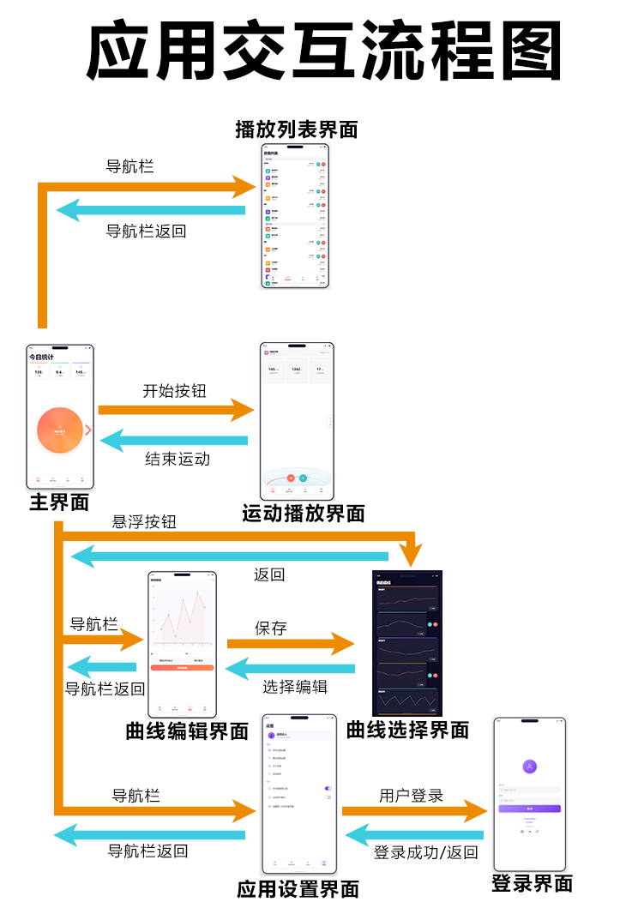
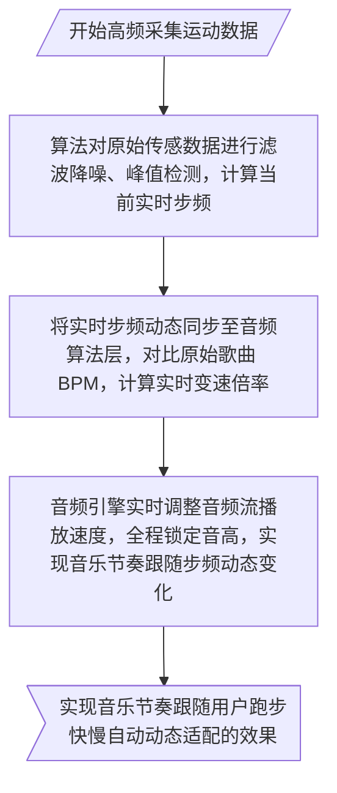
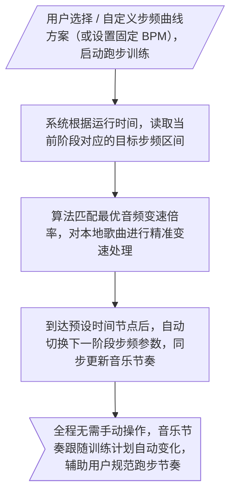
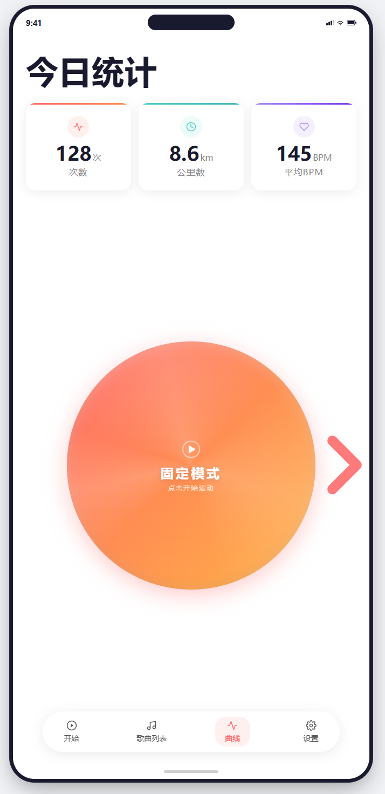
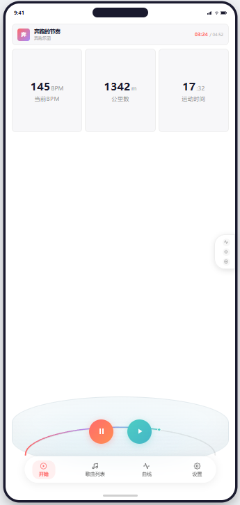
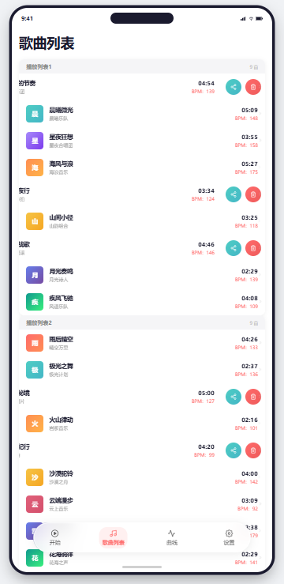
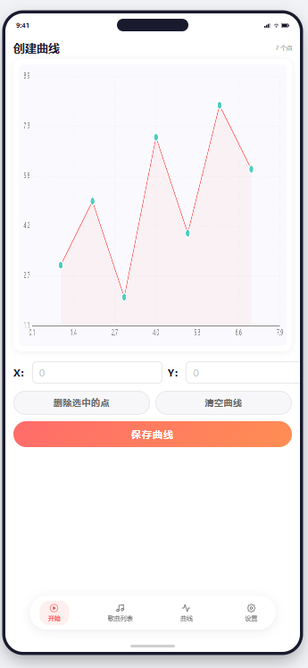
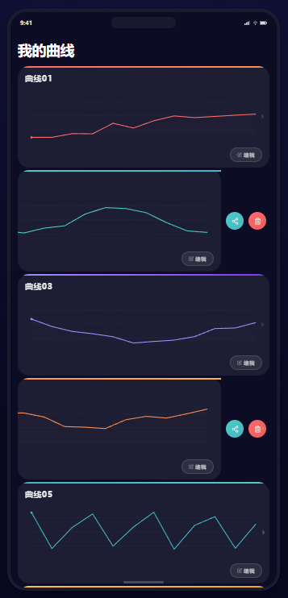
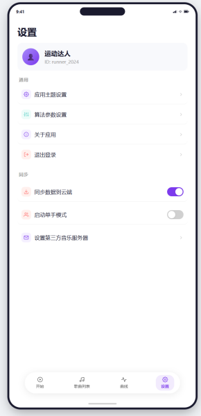

# Beat-Per-Mile 跑步电台
-red)

>《Beat-Per-Mile 跑步电台》是面向跑步人群的智能音频处理应用，通过无损音频变速技术，在不改变歌曲音高的前提下调节乐曲节奏，创新采用实时步频捕获、预设步频曲线两套控制方案，让本地音乐自动匹配跑步步频，实现脚步与乐曲精准踩点，满足休闲慢跑与专业节奏训练双重场景。

## 项目介绍
- **项目背景**：
    - 本项目基于鸿蒙（HarmonyOS）系统原生框架、多媒体音频能力与运动传感器能力，开发一款轻量化、低延迟的实时音频流变速处理引擎。引擎核心解决跑步场景下音乐节奏与人体步频不匹配的痛点，在绝对保留原歌曲音高、音色、音质的前提下，对本地任意 BPM 的音乐音频流进行实时变速调校，将歌曲节奏精准适配至用户指定跑步步频区间，实现音乐节奏与跑步步伐精准 “踩点” 的沉浸式运动体验。
    - 同时，为适配不同用户的跑步习惯、训练阶段与运动场景，系统设计双模式步频控制策略，包含实时动态步频适配与预设步频曲线适配两种核心工作模式，可自由切换，满足用户自由跑、节奏训练跑、梯度耐力跑等多元化跑步需求，打造适配鸿蒙全设备终端的智能跑步音频辅助系统。 

- **项目目标**
    - 开发一款实时音频流处理引擎，将本地任意 BPM 的歌曲变速（不改变音高）至用户设定的目标步频区间（如 160-180 BPM），实现“踩点”跑步体验。同时，目标步频区间的控制给出两个控制方案
        - 实时捕获用户步频作为目标步频
        - 使用用户预先设置好的步频曲线
## 核心技术选型
### 系统整体架构（鸿蒙四层架构设计）
- 设备感知层：调用鸿蒙 Sensor 传感器套件、运动健康服务，负责采集用户跑步步频、运动状态等原始数据
- 核心算法层：包含音频 BPM 解析算法、无损变速算法、步频匹配校准算法、预设曲线调度算法
- 应用交互层：提供参数设置、模式切换、步频可视化、歌曲管理等前端交互功能
- 音频处理引擎层
### 音频处理引擎层（核心）
- BPM 检测引擎：`Essentia`（用于实时解析音频流中的节拍点）
- 变速变调引擎：`Signalsmith Stretch`（负责高品质独立变速，MIT 协议）
-  鸿蒙 `Audio Kit` 音频处理

### 实时步频捕获（动态模式）
> 动态模式依托鸿蒙系统原生运动传感器（加速度传感器、陀螺仪） 与鸿蒙运动健康服务，实时采集用户跑步时的足部起落震动数据，通过算法滤波、去噪、计数，精准计算用户实时瞬时步频，并将该实时步频作为动态目标 BPM，实时驱动音频引擎调整音乐播放速度，实现音乐节奏跟随用户跑步快慢自动动态适配的效果

### 预设步频曲线（固定模式）
>固定模式通过用户提前自定义或选用系统内置的阶段性步频曲线方案（随时间变化的步频区间参数），系统按照预设的时间节点、步频数值梯度，自动切换目标 BPM区间，驱动音频引擎对应调整音乐节奏，通过固定节奏的音乐辅助用户完成标准化、梯度化的跑步训练

## 应用界面效果图（原稿）
|                                                主界面                                                 |运动播放界面|播放列表界面|曲线编辑界面|曲线选择界面|应用设置界面|登录界面|
|:--------------------------------------------------------------------------------------------------:|:----:|:----:|:----:|:----:|:----:|:----:|
|  |||||||

## 项目预期效果
- 实现任意本地歌曲无损变速适配跑步步频，音高零偏移、音质无损耗，节奏踩点精准
- 双模式控制方案可一键自由切换，同时满足用户随性跑步与专业训练两类核心需求
- 基于鸿蒙原生能力开发，运行稳定、延迟极低、功耗可控，适配全品类鸿蒙终端
- 实现音乐节奏与人体跑步步伐的高度契合，大幅提升跑步运动的沉浸感与运动训练效率

