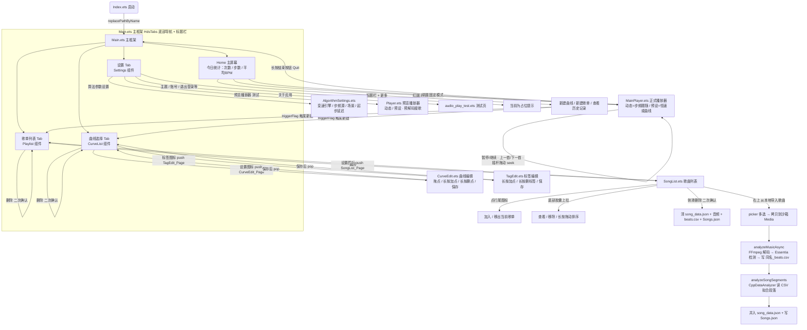

## 软件交互流程图

**最后更新：2026-09-28**

**说明**：下图依据当前代码重画 —— 页面导航与底部导航以 `entry/src/main/ets/pages/Main.ets` 为准，路由注册见 `entry/src/main/resources/base/profile/router_map.json`，各页面跳转以实际的 `pushPathByName` / `pop` 调用为准。早期那份「滑动切换模式 / 吸底栏」的交互稿已与现状不符，保留在文末作为对照。

**主界面**  

---

## 当前交互说明

### 1. 主框架与底部导航

`Main.ets` 是唯一的主页面，根节点是 `HdsNavDestination` + `HdsTabs`，底部固定四个 Tab（`Main.ets:331, 580-599`）：

| Tab | 内容组件 | 入口页面文件 |
|-----|---------|-------------|
| 主屏幕（今日统计） | 三张统计卡 + 两个大圆按钮 | `Main.ets` 内联 |
| 歌单列表 | `Playlist` | `pages/Playlist.ets` |
| 曲线选择 | `CurveList` | `pages/CurveList.ets` |
| 设置 | `Settings` | `pages/Settings.ets` |

启动页 `pages/Index.ets` 用 `replacePathByName(MainPage)` 进入主框架（`Index.ets:14`）。路由名与文件对应关系见 `router_map.json`。

### 2. 开始运动（主屏幕 → 正式播放器）

- 红圆「动态模式」：`pushPathByName(Main_Play_Page, { mode: MODE_DYNAMIC })`（`Main.ets:426-429`）。
- 绿圆「固定模式」：`pushPathByName(Main_Play_Page, { mode: MODE_CONSTANT })`（`Main.ets:484-487`）。
- `Main_Play_Page` 对应 `MainPlayer.ets`（正式播放器）。模式由入口决定，进页后不再切换；预设模式下有有效曲线走曲线，否则走恒速。
- 播放器内：暂停/继续、上一首/下一首、摇杆拖动 seek、到点自动接歌（预解码硬切）。长按红色结束按钮走 `Quit()` → `navPathStack.pop()` 回到主框架（`MainPlayer.ets:1535-1540`）。

### 3. 歌单列表 → 歌曲列表

- 点卡片：`select(index)` 把当前歌单下标写入 `AppStorage` 的 `ACTIVE_PLAYLIST_KEY`（`Playlist.ets:199-204`）。
- 设置图标：`EditSongListColumn(index)` → `pushPathByName(SongList_Page, param)`，把该歌单数据带进歌曲列表（`Playlist.ets:333-338`）。
- 删除卡片：`showWarmDialog` 二次确认后删除（`Playlist.ets:340-361`）。
- 标题栏「+」菜单的「新建歌单」通过 `triggerFlag` 触发 `Playlist` 新建（`Main.ets:232-235, 584`；`Playlist.ets:207-214`）。

### 4. 歌曲列表（导入 + 落库）

- 右上「从本地导入歌曲」：`runImportFlow()` → 拉起 picker 多选 → 拷贝到沙箱 `Media`（`SongList.ets:306-347, 1382`）。
- 每首依次：`analyzeMusicAsync` 异步分析并写 `<同名>_beats.csv` → `add_music` 写 `Songs.json` → `add_song_data` 调 `analyzeSongSegments` 并把段落并入 `song_data.json`（`SongList.ets:618-643, 1046-1079`）。
- 导入/分析期间有不可取消的进度弹窗，并禁止返回（`SongList.ets:215, 523-530, 576`）。
- 行尾图标切换「加入 / 移出当前歌单」；底部悬浮胶囊上拉面板可查看、移除、长按拖动排序；侧滑删除需二次确认，并清理 `song_data.json` / 音频 / `_beats.csv` / `Songs.json`（`SongList.ets:354-470, 900-1040`）。
- 返回：`navPathStack.pop()` 回到歌单列表（`SongList.ets:549, 569`）。

### 5. 曲线选择 → 曲线编辑 / 标签编辑

- 第一项永远是「恒定BPM」；选中曲线把下标写入 `ACTIVE_CURVE_KEY`（`CurveList.ets:609-615`）。
- 设置图标 → `CurveEdit_Page`（`CurveList.ets:623-629`）；标签图标 → `TagEdit_Page`（`CurveList.ets:632-638`）。
- 两个编辑页保存后 `navPathStack.pop()` 返回；列表页通过 `CurveStore` 的写盘版本号 `curveStoreRevision` 自动刷新（`CurveEdit.ets:1358`、`TagEdit.ets:1196`、`CurveList.ets:434-443`）。
- 标题栏「+」菜单的「新建曲线」通过 `triggerFlag` 触发 `CurveList` 新建（`Main.ets:229-231, 593`；`CurveList.ets:414-420`）。

### 6. 设置页

- 「算法参数设置」→ `Algorithm_Settings_Page`（`Settings.ets:224-228`），页内可选变速引擎（SignalSmith / 系统 Audio Kit）、步频源（模拟 / 真实传感器）、模拟场景、起步延迟校正窗口。
- 「预览播放器（测试）」→ `Player_Page`，即 `Player.ets`（`Settings.ets:231-240`）。正式播放器已挪到主页两个圆，这里仅作回归测试。
- 「关于应用」→ `Audio_test_page`（`Settings.ets:242-250`）。其余主题 / 账号 / 退出登录等目前是占位提示。

### 7. 其它路由

`router_map.json` 还注册了 `Animation_test_Page`（`Animation_test.ets`）与 `Audio_test_page`（`audio_play_test.ets`）两个测试页；`Main.ets` 里旧的「页面导航」悬浮菜单（跳 CurveList / SongList / CurveEdit / Player / TagEdit）当前**已被注释掉**，实际入口是底部 Tab 与标题栏「+」菜单。

---

## 附：早期交互稿（已过时，仅作对照）

早期版本用「开始按钮 + 左右滑动切换模式 + 吸底栏（开始/歌曲/曲线/设置）」，并设有独立的曲线绘制页 `LINER_MAKER`。与现状的主要差异：

1. 模式切换由「滑动」改为主页两个大圆按钮（红=动态 / 绿=固定）。
2. 吸底栏改为 `HdsTabs` 底部四个 Tab（主屏幕 / 歌单列表 / 曲线选择 / 设置）。
3. 曲线绘制拆成 `CurveEdit.ets`（曲线编辑）与 `TagEdit.ets`（标签编辑）两页。
4. 新增正式播放器 `MainPlayer.ets`，原 `Player.ets` 退化为设置页里的预览/回归测试入口。
5. 新增算法参数设置页 `AlgorithmSettings.ets`。
6. 歌曲列表不再从吸底栏进入，而是从「歌单列表」的设置图标 push 进入。
