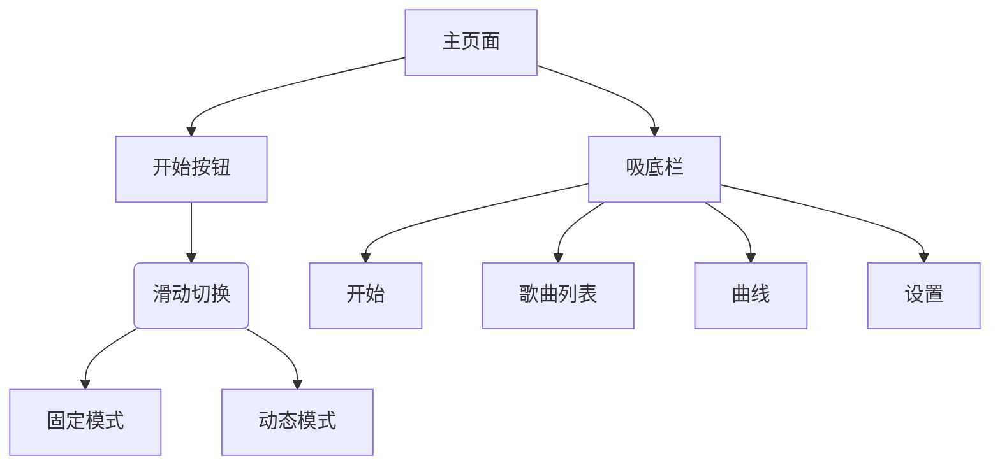

## 软件交互流程图

```mermaid
flowchart TD
    A[主页面] --> B[开始按钮]
    B --> H(滑动切换)
    H --> C[固定模式]
    H --> D[动态模式]
    A --> E[吸底栏]
    E --> Start[开始]; E --> Song[歌曲列表]; E --> liner[曲线] ;E -->setting[设置]
```
