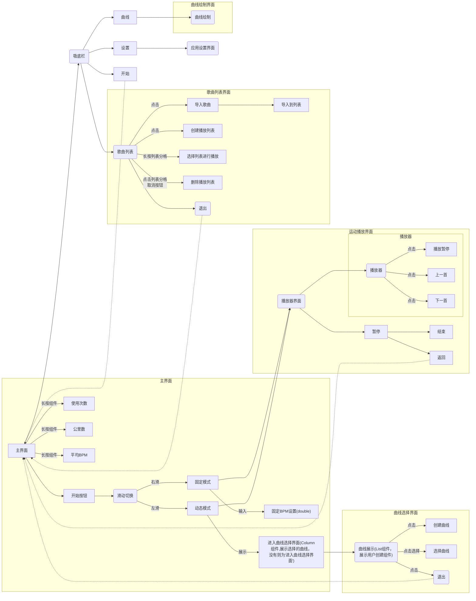

## 软件交互流程图
**主界面**  

```mermaid
flowchart LR
    
    subgraph 主界面
        A[主界面]
        B[开始按钮]
        BPM_SET["固定BPM设置(double)"]
        LINER_SET["进入曲线选择界面(Column组件,展示选择的曲线，<br>没有则为'进入曲线选择界面')"]
        used_time[使用次数]
        kilometer[公里数]
        Per_BPM[平均BPM]
        
        A --> B
        A -->|长按组件| used_time
        A -->|长按组件|kilometer
        A -->|长按组件| Per_BPM
        B --> H(滑动切换)
        H --> |右滑|C[固定模式]
        H --> |左滑|D[动态模式]
        C -->|输入| BPM_SET
        D --> |展示|LINER_SET
    end
    A --> E(吸底栏)
    subgraph 运动播放界面
        media_play(播放器界面)
        media_play --> player
        C --> media_play
        D --> media_play
        media_play --> pause
        pause[暂停]--> end_[结束]
        pause --> back_[返回]
        back_ -.-> A
        
        subgraph 播放器
            pause_[播放暂停]
            formal[上一首]
            next[下一首]
            player(播放器)
            
            player -->|点击| pause_
            player -->|点击| formal
            player -->|点击| next
        end
    end
    
    subgraph 曲线选择界面 
        liner_set("曲线展示(List组件，<br>展示用户创建组件)")
        make_liner[创建曲线]
        chosen[选择曲线]
        back_liner(退出)
        
        LINER_SET --> liner_set -->|点击| make_liner
        liner_set -->|点击选择| chosen
        liner_set -->|点击| back_liner
        back_liner -.-> A
    end
    
    subgraph 歌曲列表界面
        SONG_LIST(歌曲列表) -->|点击| 导入歌曲 --> 导入到列表
        SONG_LIST --> |点击| 创建播放列表
        SONG_LIST -->|长按列表分格|选择列表进行播放
        SONG_LIST -->|点击列表分格<br>取消按钮| 删除播放列表
        SONG_LIST --> Song_back(退出)
        Song_back -.-> A
    end
    
    
    subgraph 曲线绘制界面
        LINER_MAKER(曲线绘制)
    end
    
    E --> Start[开始] -.-> A; E --> SONG_LIST; E --> liner[曲线] ;E -->setting[设置]
    liner --> LINER_MAKER
    setting --> Setting_page(应用设置界面)


```

