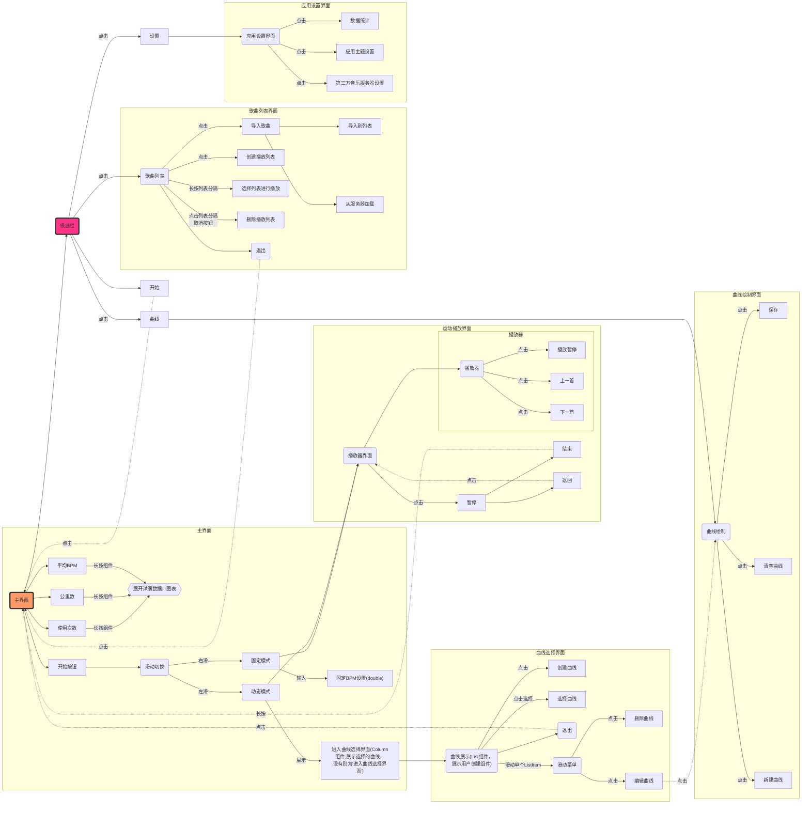

## 软件交互流程图
**主界面**  

```mermaid
flowchart LR
    
    subgraph 主界面
        A("<div style='text-align:center;'>主界面</div>")
        B[开始按钮]
        BPM_SET["固定BPM设置(double)"]
        LINER_SET["进入曲线选择界面(Column组件,展示选择的曲线，<br>没有则为'进入曲线选择界面')"]
        used_time[使用次数]
        kilometer[公里数]
        Per_BPM[平均BPM]
        Detail{{"展开详细数据，图表"}}

        A --> B
        A --> used_time -->|长按组件| Detail
        A --> kilometer -->|长按组件| Detail
        A --> Per_BPM -->|长按组件| Detail
        B --> H(滑动切换)
        H --> |右滑|C[固定模式]
        H --> |左滑|D[动态模式]
        C -->|输入| BPM_SET
        D --> |展示|LINER_SET
        
        style A fill:#f96,stroke:#333,stroke-width:4px
        style E fill:#f38,stroke:#333,stroke-width:4px
    end
    A --> E(吸底栏)
    subgraph 运动播放界面
        media_play(播放器界面)
        media_play --> player
        C --> media_play
        D --> media_play
        media_play --> |点击|pause
        pause[暂停]--> end_[结束]
        pause --> back_[返回]
        end_ -.->|长按| A
        back_ -.->|点击| media_play
        
        subgraph 播放器
            pause_[播放暂停]
            formal[上一首]
            next[下一首]
            player(播放器)
            
            player -->|点击| pause_
            player -->|点击| formal
            player -->|点击| next
        end
    end
    
    subgraph 曲线选择界面 
        liner_set("曲线展示(List组件，<br>展示用户创建组件)")
        make_liner[创建曲线]
        chosen[选择曲线]
        back_liner(退出)
        slide_liner(滑动菜单)
        delete_liner[删除曲线]
        edit_liner[编辑曲线]
        
        LINER_SET --> liner_set -->|点击| make_liner
        liner_set -->|点击选择| chosen
        liner_set --> back_liner
        liner_set --> |滑动单个ListItem| slide_liner
        slide_liner -->|点击| delete_liner
        slide_liner -->|点击| edit_liner
        back_liner -.->|点击| A
    end
    
    subgraph 歌曲列表界面
        SONG_LIST(歌曲列表) -->|点击| 导入歌曲 --> 导入到列表
        导入歌曲 --> 从服务器加载
        SONG_LIST --> |点击| 创建播放列表
        SONG_LIST -->|长按列表分隔|选择列表进行播放
        SONG_LIST -->|点击列表分隔<br>取消按钮| 删除播放列表
        SONG_LIST --> Song_back(退出)
        Song_back -.->|点击| A
    end
    
    
    subgraph 曲线绘制界面
        LINER_MAKER(曲线绘制)
        LINER_SAVE[保存]
        LINER_CLEAR[清空曲线]
        LINER_NEW[新建曲线]
        
        edit_liner -.->|点击| LINER_MAKER
        LINER_MAKER -->|点击| LINER_SAVE
        LINER_MAKER -->|点击| LINER_CLEAR
        LINER_MAKER -->|点击| LINER_NEW
    end
    
    subgraph 应用设置界面 
        setting_data_collect[数据统计]
        setting_adder[应用主题设置]
        setting_music_server[第三方音乐服务器设置]
        
        Setting_page -->|点击| setting_data_collect
        Setting_page -->|点击| setting_adder
        Setting_page -->|点击| setting_music_server
        
    end
    
    E --> Start[开始] -.->|点击| A; E -->|点击| SONG_LIST; E -->|点击| liner[曲线] ;E -->|点击| setting[设置]
    liner --> LINER_MAKER
    setting --> Setting_page("应用设置界面")


```

